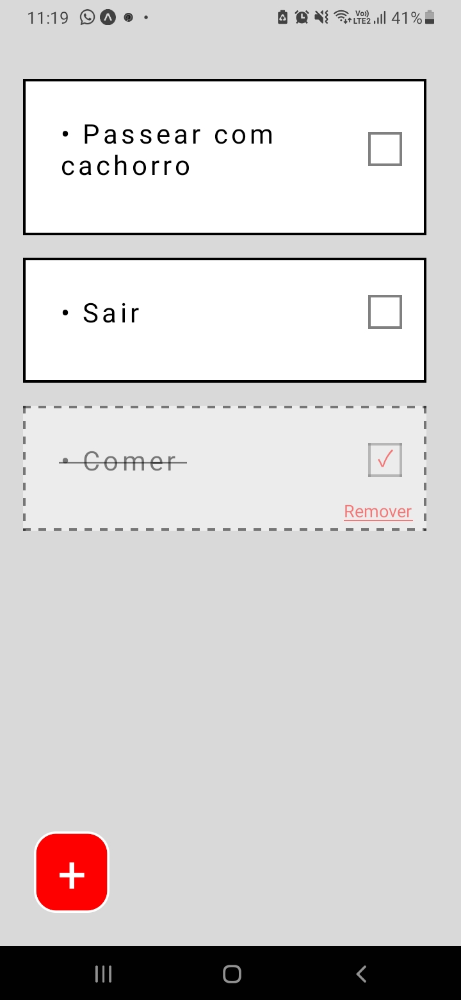

# To-Do List React Native
## Lista de tarefas em React Native - (Front-end)

Este é o repositório do código responsável pelo front-end da aplicação de lista de tarefas que desenvolvi utilizando React Native e Expo.  
Para inicializar a execução do app será necessário:

<ul>
  <li>Fazer o git clone do repositório do back-end do projeto que está nesse endereço: <a href="https://github.com/Guilherme-07062002/APIToDoList.git">Clique aqui</a> e inicializar o servidor;</li>
  <li>Instalar os pacotes necessários digitando <code>npm i</code> no terminal;</li> 
  <li>Para inicializar a execução digite <code>npm start</code>.</li>
  <li>Utilize algum emulador ou o seu proṕrio smartphone com o app Expo Go (como eu fiz) para vê-lo funcionar;</li> 
</ul>

Após tudo ok espera-se que seja possivel ver a aplicação funcionando normalmente.

### Funcionamento:
</img>

O app consiste em um sistema simples de lista de tarefas, ainda pretendo trabalhar nele e adicionar mais algumas melhorias e funcionalidades.

Com ele é possível:

<ul>
  <li>Adicionar tarefas: apertando no botão com o "+" no canto inferior esquerdo da tela.</li>
  <li>Marcar uma tarefa como concluída, aonde ela fica com um aspecto transparente na tela e marcada com um simbolo de 'visto', caso o usuário queira realizar aquela tarefa novamente é só apertar de novo o checkbox, e ela será desmarcada.</li>
  <li>Remover tarefas: Se o usuário não quiser que aquela tarefa continue sendo exibida na tela, após apertar no botão de marcá-la como concluída é exibido logo abaixo a opção de remover (em vermelho), dessa forma a tarefa será apagada.</li>
</ul>

O repositório do back-end necessário para executar esta aplicação pois todas as operações e serão realizadas e armazenadas em conjunto com o banco de dados, que neste caso optei por utilizar o sqlite3, pelo fato deste ser um BD embutido que conforme eu teorizo vai junto da aplicação, portanto se eu disponibilizar este projeto para download (em algum momento futuro), mesmo que o usuário feche o aplicativo, ao abri-lo novamente os dados permaneceriam salvos.

E para isso tudo que acontece reflete no banco de dados, ao apagar tarefas elas também serão apagadas no banco, ao adicionar da mesma forma, e quando o usuário abrisse a aplicação ela retornaria as tarefas que até então teriam sido salvas pela ultima vez.

